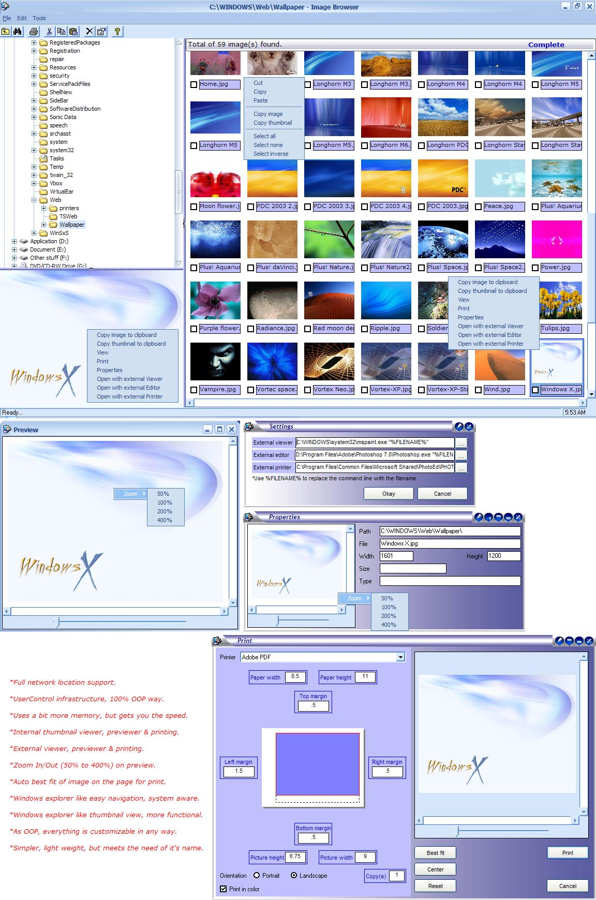



## \_Image\_Browser\_Explorer\_

### Description

A simple image explorer like ACDSee but much simpler, primer, lightweight & with source :) Explorer like navigation & thumbnail view, preview, printing, etc. Thanks to GonChuki for his nice Chameleon button, other than that, all are mine develops. This has been done in complete OOP way. Password is 'password' (of course without the single quotes). This is not complete yet, I am adding more features whenever I get some time.
 
### More Info
 

             |
---                |---
**Submitted On**   |2004-09-17 18:22:10
**By**             |[Broken Arrow](https://github.com/Planet-Source-Code/PSCIndex/blob/master/ByAuthor/broken-arrow.md)
**Level**          |Intermediate
**User Rating**    |4.4 (31 globes from 7 users)
**Compatibility**  |VB 6\.0
**Category**       |[Complete Applications](https://github.com/Planet-Source-Code/PSCIndex/blob/master/ByCategory/complete-applications__1-27.md)
**World**          |[Visual Basic](https://github.com/Planet-Source-Code/PSCIndex/blob/master/ByWorld/visual-basic.md)
**Archive File**   |[\_Image\_Bro1795029172004\.zip](https://github.com/Planet-Source-Code/broken-arrow-image-browser-explorer__1-56233/archive/master.zip)

